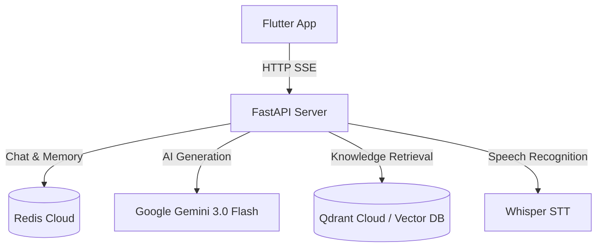

# Quint AI — AI-Powered UNT Exam Preparation Platform

Quint AI is a fullstack AI assistant built for students preparing for the **UNT** (Unified National Testing) in Kazakhstan. It combines a **FastAPI** backend with a **Flutter** mobile frontend to deliver intelligent, context-aware tutoring across Math, Informatics, and History.


---

## Architecture Overview

```
FullStack_Platform/
├── Backend/          # FastAPI REST API + AI services
└── FrontEND/         # Flutter mobile app (Android / iOS)
```



---

## Backend

Located in `Backend/`. A FastAPI server that handles all application logic: chat management, AI generation, semantic search, voice transcription, and rate limiting.

### Technology Stack

| Component | Technology |
|-----------|-----------|
| Web Framework | FastAPI 0.104+ with Uvicorn (SSE Streaming) |
| AI / LLM | Google Gemini 3.0 Flash |
| Caching & Storage | Redis Cloud (via `redis-py` + `msgpack`) |
| Semantic Search | Google gemini-embedding-001 |
| Vector Database | Qdrant Cloud |
| Speech-to-Text | Hugging Face Whisper (GPU-accelerated) |
| Bot Interface | Aiogram 3 (Telegram) |
| Config Management | Pydantic Settings + `.env` |

### Project Structure

```
Backend/
├── src/
│   ├── api_server.py          # FastAPI app — all REST endpoints
│   ├── bot.py                 # Telegram bot entry point
│   ├── config.py              # Settings (loaded from .env, NOT committed)
│   ├── handlers/
│   │   └── message_handler.py # Telegram message routing
│   └── services/
│       ├── ai.py              # AI response generation + RAG pipeline
│       ├── cache.py           # Redis wrapper (chat storage, rate limiting)
│       ├── speech_to_text.py  # Whisper-based Kazakh ASR
│       ├── embeddings.py      # Sentence embedding model
│       ├── vector_db.py       # Local SQLite vector store
│       ├── improved_rag_service.py  # RAG retrieval logic
│       ├── chunker.py         # Document text chunking
│       ├── document_loader.py # Load RAG documents from JSON
│       ├── indexer.py         # Index documents into vector DB
│       └── analytics.py       # Usage tracking
├── RAG/                       # Knowledge base (60+ JSON files)
│   ├── math_*.json            # Math problems: algebra, geometry, calculus
│   ├── informatics_*.json     # CS topics: Python, SQL, networking
│   └── history_*.json         # History content
├── scripts/
│   └── index_documents.py     # Script to index RAG docs into vector DB
├── tests/
│   ├── test_rag_system.py     # RAG system integration tests
│   ├── verify_rag.py          # RAG quality verification
│   └── tst.py                 # Miscellaneous test scripts
├── documents.db               # SQLite vector database
├── main.py                    # Telegram bot runner
└── requirements.txt           # Python dependencies
```

### REST API Endpoints

| Method | Endpoint | Description |
|--------|----------|-------------|
| `GET` | `/` | API info and available routes |
| `GET` | `/health` | Health check (Redis ping + model status) |
| `POST` | `/api/chats/new` | Create a new chat conversation |
| `GET` | `/api/chats/{user_id}` | List all chats for a user |
| `DELETE` | `/api/chats/{chat_id}?user_id=` | Delete a chat and its history |
| `PATCH` | `/api/chats/{chat_id}` | Rename a chat |
| `GET` | `/api/chats/{user_id}/{chat_id}/history` | Get message history for a chat |
| `POST` | `/api/chat` | Send a text message, get AI response |
| `POST` | `/api/chat/stream` | **Streaming** AI response (SSE) |
| `POST` | `/api/voice` | Send audio file, get transcription + AI response |
| `GET` | `/api/status/{user_id}` | Rate limit info (count / remaining / reset) |

Interactive docs available at `http://localhost:8000/docs` when the server is running.

### How the AI Pipeline Works

1. **Request arrives** at `/api/chat` with `user_id`, `chat_id`, and `message`
2. **Rate limit check** — max 15 messages per 24 hours per user (enforced in Redis)
3. **Chat history loaded** from Redis (`chat_history:{user_id}:{chat_id}`)
4. **RAG retrieval** — the message is embedded via **gemini-embedding-001** and semantically matched against the knowledge base in **Qdrant Cloud** to find the top-K relevant passages
5. **Prompt assembled** — system prompt + retrieved context + full conversation history sent to Gemini 3.0 Flash
6. **Streaming Response** — Gemini generates tokens, backend yields them via SSE to Flutter
7. **History updated** — Full response saved in Redis after streaming finishes (TTL: 7 days)
8. **Chat metadata updated** (last message preview, message count, TTL: 30 days)

### Chat & Rate Limiting Data Model (Redis)

| Key Pattern | Type | TTL | Content |
|-------------|------|-----|---------|
| `user_chats:{user_id}` | List | 30d | Ordered list of chat UUIDs |
| `chat_metadata:{user_id}:{chat_id}` | String (msgpack) | 30d | Title, created_at, last_message, count |
| `chat_history:{user_id}:{chat_id}` | String (msgpack) | 7d | Array of `"User: ..."` / `"AsylBILIM: ..."` strings |
| `rate_limit:{user_id}` | String | 24h | Message count for the current window |

### Voice Input (Speech-to-Text)

The `/api/voice` endpoint:
1. Receives an audio file upload (OGG format expected from mobile)
2. Converts to WAV, resamples to 16kHz mono if needed
3. Runs **Hugging Face Whisper** (`openai/whisper-*`) with `language="kazakh"` for transcription
4. Uses the recognized text as the message input for the standard AI pipeline
5. Returns both `recognized_text` and `response` in the JSON response

> GPU (CUDA) is used automatically if available; falls back to CPU.

### RAG Knowledge Base

The `RAG/` folder contains 60+ JSON files structured as Q&A or content chunks covering:
- **Mathematics**: algebra, geometry, calculus, trigonometry, combinatorics, probability, sequences
- **Informatics**: Python, JavaScript, SQL, HTML/CSS, networking, algorithms, data structures
- **History**: Kazakhstan history with context documents

These are indexed into `documents.db` (SQLite-backed vector store using `sentence-transformers` embeddings). Run the indexer to rebuild:

```bash
python scripts/index_documents.py
```

### Setup & Running

#### 1. Environment Variables

Create `Backend/.env` (never committed):

```env
BOT_TOKEN=your_telegram_bot_token
LLM_API_KEY=your_google_gemini_api_key
REDIS_HOST=your_redis_host
REDIS_PORT=6379
REDIS_PASSWORD=your_redis_password
REDIS_USERNAME=default
```

#### 2. Install Dependencies

```bash
cd Backend
pip install -r requirements.txt
```

> Note: PyTorch is installed with CUDA 13.0 support. Adjust the `--index-url` in `requirements.txt` if you use a different CUDA version or CPU-only.

#### 3. Start the API Server

```bash
# From the Backend/ directory
python -m uvicorn src.api_server:app --host 0.0.0.0 --port 8000 --reload
```

#### 4. Start the Telegram Bot (optional)

```bash
python main.py
```

---

## FrontEND

Located in `FrontEND/`. A Flutter mobile application providing the chat UI that communicates with the backend over HTTP.

### Technology Stack

| Component | Technology |
|-----------|-----------|
| Framework | Flutter 3.0+ / Dart |
| HTTP Client | `http` package |
| Markdown Rendering | `flutter_markdown` |
| Persistent Storage | `shared_preferences` |
| Audio Recording | `record` |
| File System | `path_provider` |
| Permissions | `permission_handler` |

### Project Structure

```
FrontEND/
├── lib/
│   ├── main.dart                  # App entry point, MaterialApp, dark theme
│   ├── models/
│   │   ├── chat_info.dart         # ChatInfo: id, title, created_at, last_message
│   │   ├── chat_message.dart      # ChatMessage: id, text, isUser, timestamp
│   │   ├── rate_limit_info.dart   # RateLimitInfo: count, limit, remaining, reset_time
│   │   └── models.dart            # Barrel export
│   ├── screens/
│   │   └── chat_screen.dart       # Main stateful screen (all chat logic)
│   ├── services/
│   │   └── api_service.dart       # All HTTP calls to backend
│   └── widgets/
│       ├── chat_drawer.dart       # Slide-out drawer: chat list, create, delete, rename
│       ├── chat_input_area.dart   # TextField + send/mic buttons + rate limit badge
│       ├── message_bubble.dart    # User/bot bubbles + animated typing indicator
│       ├── welcome_screen.dart    # Empty state shown when no chat is selected
│       └── widgets.dart           # Barrel export
├── pubspec.yaml
├── README.md
└── .gitignore
```

### Features

- **Multiple Chats** — create, switch between, rename, and delete conversations, all persisted in the drawer
- **Markdown Rendering** — bot responses render `**bold**`, *italics*, `code`, code blocks, lists, and headers using `flutter_markdown`
- **Voice Input** — record audio, which is sent to `/api/voice` for transcription and an AI response
- **Persistent User ID** — saved on first launch so chat history survives app restarts
- **SSE Streaming** — real-time response delivery for minimal perceived latency
- **Word-by-word Typing** — bot responses reveal progressively for a premium feel
- **Offline Banner** — red banner appears at the top when the backend is unreachable
- **Rate Limit Badge** — shows remaining messages per day (`X/15`) in the input area

### API Service Summary (`api_service.dart`)

| Method | Backend Endpoint | Purpose |
|--------|-----------------|---------|
| `getChats(userId)` | `GET /api/chats/{user_id}` | Load chat list |
| `createChat(userId)` | `POST /api/chats/new` | Create new chat |
| `deleteChat(userId, chatId)` | `DELETE /api/chats/{chatId}` | Delete a chat |
| `renameChat(userId, chatId, title)` | `PATCH /api/chats/{chatId}` | Rename a chat |
| `getChatHistory(userId, chatId)` | `GET /api/chats/{userId}/{chatId}/history` | Load message history |
| `sendMessage(userId, chatId, msg)` | `POST /api/chat` | Send text message |
| `sendVoiceMessage(userId, chatId, path)` | `POST /api/voice` | Send audio file |
| `getRateLimitInfo(userId)` | `GET /api/status/{userId}` | Check rate limit |
| `checkHealth()` | `GET /health` | Server health check |

### Setup & Running

#### Prerequisites
- [Flutter SDK](https://docs.flutter.dev/get-started/install) ≥ 3.0.0
- Android SDK (via Android Studio or command-line tools)
- Backend running at `localhost:8000` (or update `ApiService.baseUrl`)

#### Install & Run

```bash
cd FrontEND
flutter pub get
flutter run
```

#### Platform URL Configuration

The app auto-detects the environment in `api_service.dart`:

```dart
static String get baseUrl {
  if (Platform.isAndroid) return 'http://10.0.2.2:8000/api';  // Android emulator
  return 'http://localhost:8000/api';                          // iOS / Desktop
}
```

For a **physical device**, replace with your machine's LAN IP (e.g., `http://192.168.1.100:8000/api`) and start the backend with `--host 0.0.0.0`.

---

## Security

The following are **gitignored** and must never be committed:

| File | Reason |
|------|--------|
| `Backend/.env` | API keys, Redis password |
| `Backend/src/config.py` | Settings class with defaults |
| `Backend/SYSPROMPT.txt` | System prompt for the AI |
| `venv/` | Python virtual environment |
| `__pycache__/` | Python bytecode |
| `FrontEND/build/` | Flutter build artifacts |
| `FrontEND/android/key.properties` | Android signing key config |

---

## Development Workflow

```bash
# Terminal 1 — Start backend
cd Backend
python -m uvicorn src.api_server:app --host 0.0.0.0 --port 8000 --reload

# Terminal 2 — Run Flutter app
cd FrontEND
flutter run

# Optional — Re-index RAG knowledge base after adding new JSON files
cd Backend
python scripts/index_documents.py
```

---

## Rate Limiting

Each `user_id` is limited to **15 messages per 24 hours** (combined text + voice). The limit resets after the 24-hour window. The Flutter app displays the remaining count in the input area and shows a `429 Too Many Requests` error when the limit is reached.

---

## License

MIT
